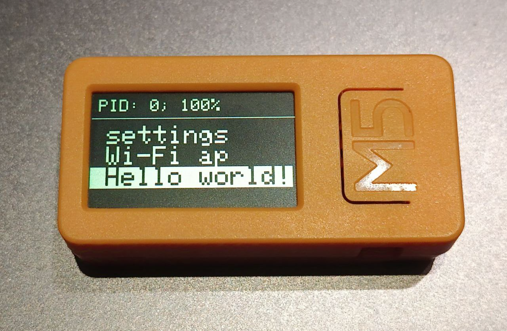
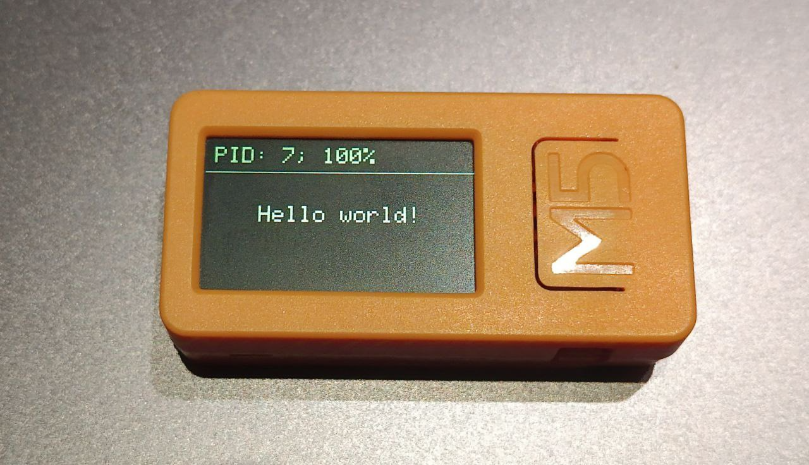

# Simple firmware for M5StickCPlus2 with [web interface](#web-interface-screenshot) 


## How to build?
You can use the extension **arduino community edition** for build and upload firmware in vs code.

Here is example of configuration files which I'm using:

*.vscode/arduino.json*
```
{
    "sketch": "m5stick_power_firmware.ino",
    "port": "/dev/ttyACM0",
    "board": "m5stack:esp32:m5stack_stickc_plus2",
    "output": "./build",
    "programmer": "esptool",
    "configuration": "PSRAM=enabled,PartitionScheme=default_8MB,CPUFreq=240,FlashMode=qio,FlashFreq=80,FlashSize=8M,UploadSpeed=1500000,LoopCore=1,EventsCore=1,DebugLevel=none,EraseFlash=none"
}
```


*.vscode/settings.json*
```
{
    "C_Cpp.intelliSenseEngine": "Tag Parser",
    "C_Cpp.default.includePath": [
        "${workspaceRoot}",
        "~/Arduino/libraries"
    ],
    "arduino.enableUSBDetection": true,
    "arduino.additionalUrls": ["https://m5stack.oss-cn-shenzhen.aliyuncs.com/resource/arduino/package_m5stack_index.json"],
    "arduino.disableIntelliSenseAutoGen": true
}
```


## How to add a new feature?

Add a menu item wherever you want. 
You must specify the name and number of the process that will be launched. You can take the first one available. Check the [process id list](#list-of-process-ids).

*functions/mainMenuLoop.h*
```
MENU mainMenu[] = {
    // other items ...
    {"Hello world!", 7},
};
```


After that, create a function for the process, let's create a new file for this in the *functions* directory

*functions/helloWorldLoop.h*

```
void helloWorldLoop() {
    if (isSetup()) {
        centeredPrint("Hello world!", SMALL_TEXT);
    }
    checkExit(0);

    // Description of the behavior of the function inside the web interface
    if (isWebDataRequested()) {
        webData = generateWebData("menu", generateFunctionElement("Hello world!", SMALL_TEXT, "center"));
    }
}
```
Using the isSetup function ensures that the code inside the condition will only be executed once after the function runs.
The checkExit function will perform a process switch when pressing the B button. In this case, we will return to the main menu, since its process is 0.

<br>

Add an include of this function next to the others.

*globals/functions.h*

```
// other includes...
#include "../functions/helloWorldLoop.h"
```

Finally, add the case to the switch inside the loop function in the m5stick_power_firmware.ino file
```
case 7:
    helloWorldLoop();
    break;
```
## ✨ Result:



### List of process IDs

0. mainMenu  
1. clock  
2. battery info  
3. settingsMenu  
4. Wi-Fi AP  
5. brightness  
6. rotation


### Web interface screenshot:


## ❤️ Support my project with a star if you liked it. Contributing is welcome.

This is my first open project, I will be glad for any support