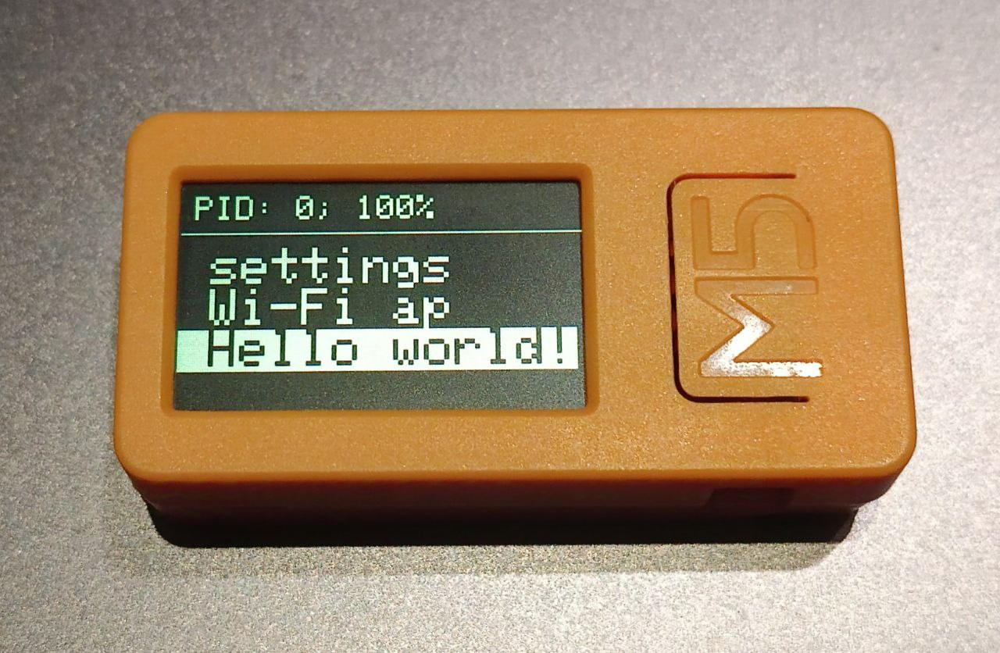
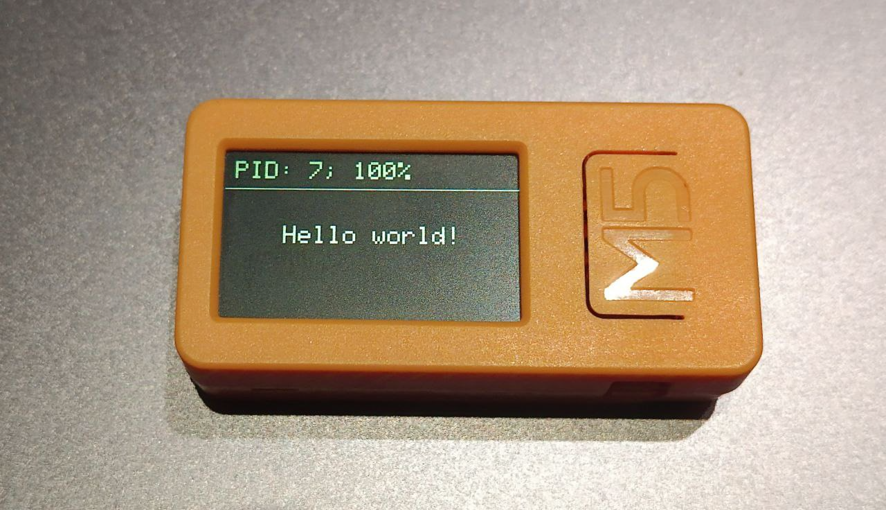

## How to add a new feature?

Add a menu item wherever you want.
You must specify the name and number of the process that will be launched. You can take the first one available. Check the [process id list](./pids.md).

*functions/mainMenuLoop.h*

```cpp
MENU mainMenu[] = {
	// other items ...
	{40, "Hello world!"},
};
```



After that, create a function for the process, let's create a new file for this in the *functions* directory

*functions/helloWorldLoop.h*

```cpp
void helloWorldLoop() {
	if (isSetup()) {
		centeredPrint("Hello world!", SMALL_TEXT);
	}
	checkExit(0);
}
```

In this code, we used functions, one of the “utilities”, necessary to make the code easier and cleaner. They are all located inside files in the utils directory.
Some utilities are already described in the [utilities documentation](./utils.md).

<br>

Add an include of this function next to the others.

*globals/functions.h*

```cpp
// other includes...
#include "../functions/helloWorldLoop.h"
```

Finally, add your process to the processEntries array.

*globals/switcher.h*

```cpp
const ProcessEntry processEntries[] = {
	// ...
	{40, helloWorldLoop},
}
```

## ✨ Result


