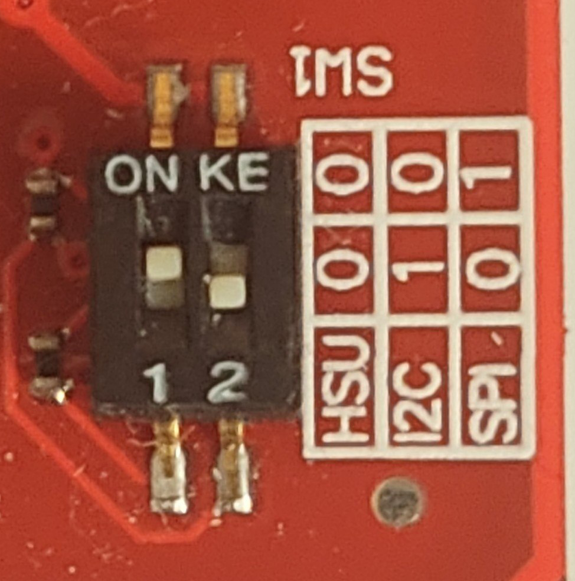
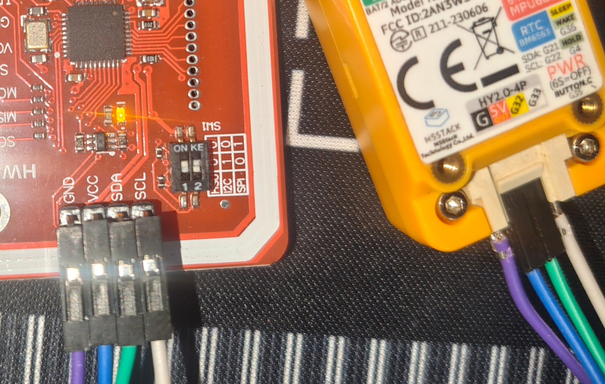

# Module Connection Guide

- [NFC (PN532)](#nfc-pn532)
- [SD Card](#sd-card)
- [IR reciever](#ir-reciever)

---

## NFC (PN532)

Connect the PN532 module to the GROVE port. Switch the module to **I2C mode**.

### M5StickC Plus 2

| M5StickCPlus2 (GROVE) | PN532 |
| - | - |
| G | GND |
| 5V | VCC |
| G32 | SDA |
| G33 | SCL |

### M5StickS3

| M5StickS3 (GROVE) | PN532 |
| - | - |
| G | GND |
| 5V | VCC |
| G9 | SDA |
| G10 | SCL |

### Cardputer-ADV

| Cardputer-ADV (GROVE) | PN532 |
| - | - |
| GND | GND |
| 5V | VCC |
| G2 | SDA |
| G1 | SCL |

## SD Card

### M5StickC Plus 2

| M5StickCPlus2 | SD module |
| - | - |
| GND | GND |
| G36 / G25 | MISO |
| G0 | CLK |
| G26 | MOSI |
| G (grove) | CS |
| 3V3 | 3V3 |

### M5StickS3

| M5StickS3 | SD module |
| - | - |
| GND | GND |
| G4 | MISO |
| G5 | CLK |
| G6 | MOSI |
| G7 | CS |
| 3V3 | 3V3 |

## IR reciever

### M5StickC Plus 2

| M5StickCPlus2 | IR Reciever module |
| - | - |
| GND | GND |
| 5V | VCC |
| G26 | OUT |

## Cardputer-ADV

| Cardputer | IR Reciever module |
| - | - |
| GND | GND |
| 5V OUT/IN | VCC |
| G3 | OUT |
