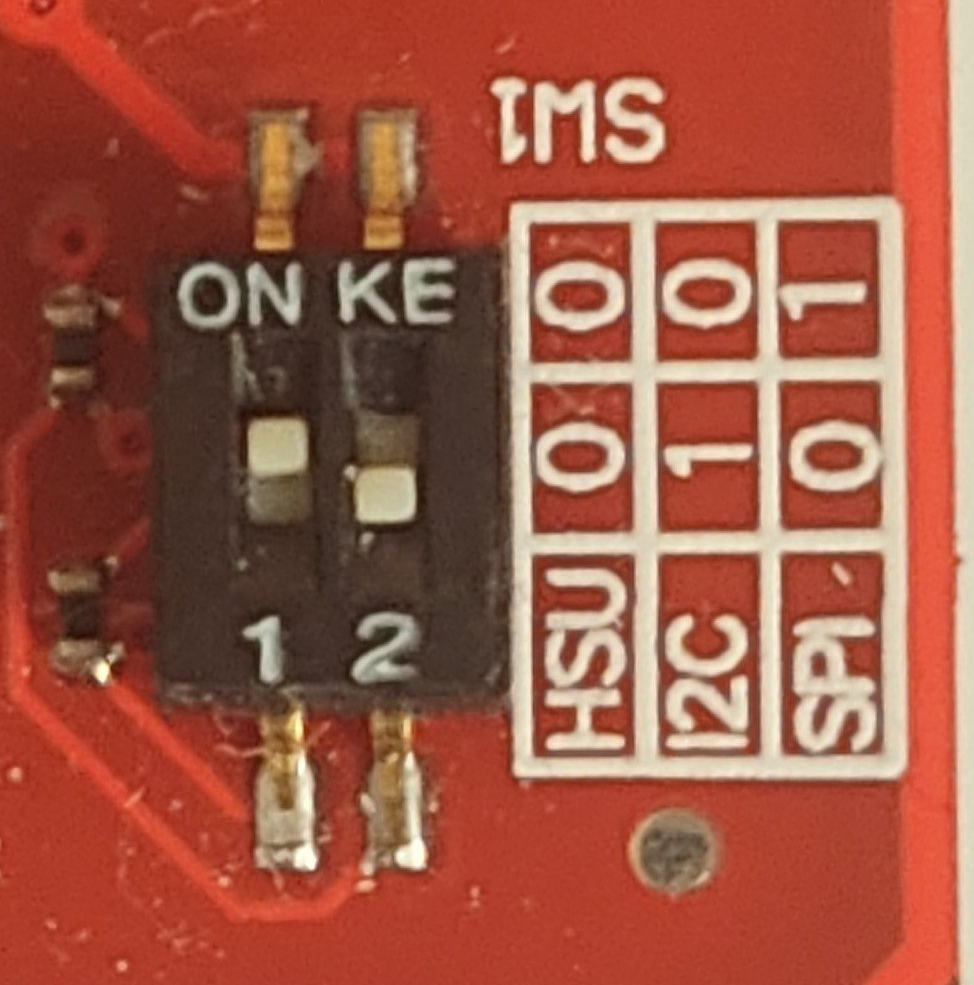
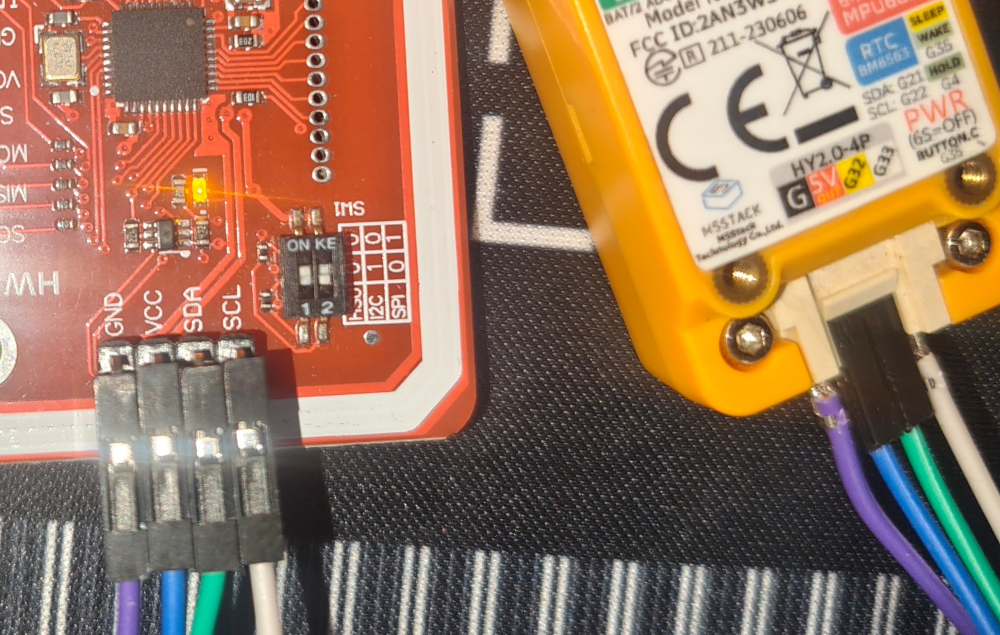

# How to use NFC feature

Currently, the Crystal firmware supports reading UIDs and changing UIDs on mifare magic tags gen 2 (Also known as "Writable CUID") using the PN532 module.

The module is connected directly to the GROVE port of m5stick, switch the module to I2C mode

## Connection guide

|M5stick GROVE port|PN532|
|-|-|
|G|GND|
|5V|VCC|
|G32|SDA|
|G33|SCL|

### In the future I may add other modules, connection methods and new features. Write your suggestions through issues, put a star on the repository so as not to miss a new release
